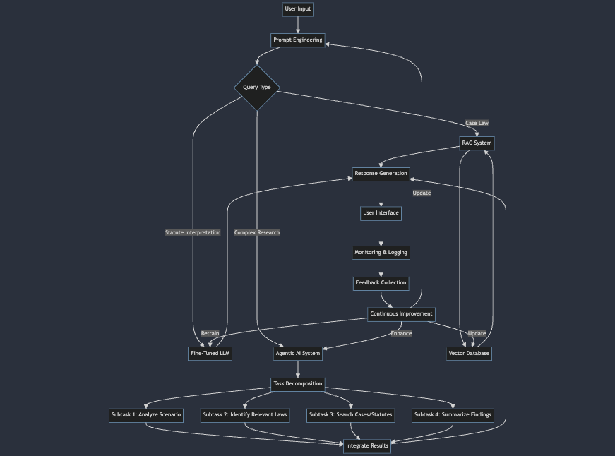

# AI-Powered Legal Research Assistant

## Overview
Develop an AI-powered legal research assistant to help law firms and legal professionals quickly find relevant case law, statutes, and legal precedents. This system will streamline the legal research process, saving time and improving the accuracy of legal arguments.

## Components

### 1. Prompt Engineering
- Design effective prompts to query the legal assistant about specific legal questions or case scenarios.
- Implement prompt templates for different types of legal inquiries (e.g., case law search, statute interpretation, legal precedent analysis).

### 2. Retrieval Augmented Generation (RAG)
- Create a knowledge base of legal documents, including case law, statutes, and legal commentaries.
- Implement RAG to allow the AI to retrieve relevant legal information and generate accurate, context-aware responses.

### 3. Fine-Tuning
- Fine-tune a pre-trained language model on a corpus of legal texts to improve its understanding of legal terminology and concepts.
- Adapt the model to recognize and interpret legal citations and references.

### 4. Agentic AI Systems
- Develop an autonomous agent that can perform multi-step legal research tasks, such as:
  - Analyzing a given legal scenario
  - Identifying relevant areas of law
  - Searching for applicable cases and statutes
  - Summarizing findings and suggesting potential arguments

### 5. Deployment and Monitoring
- Deploy the legal research assistant as a web application accessible to law firm employees.
- Implement monitoring systems to track usage, performance, and accuracy of the AI's responses.
- Set up logging and feedback mechanisms to continuously improve the system.

## Implementation Steps

1. **Data Collection and Preparation**
   - Gather a large corpus of legal documents, including case law, statutes, and legal commentaries.
   - Preprocess and structure the data for efficient retrieval and indexing.

2. **Model Selection and Fine-Tuning**
   - Choose a suitable pre-trained language model (e.g., GPT-3.5, BERT, or a legal-specific model).
   - Fine-tune the model on the legal corpus to improve domain-specific understanding.

3. **RAG System Implementation**
   - Set up a vector database to store embeddings of legal documents.
   - Implement a retrieval system that can quickly find relevant documents based on user queries.
   - Integrate the retrieval system with the language model for generating responses.

4. **Prompt Engineering**
   - Design a set of prompt templates for various legal research tasks.
   - Implement a prompt optimization system to refine prompts based on user feedback and performance metrics.

5. **Agentic System Development**
   - Create a goal-oriented agent that can break down complex legal research tasks into subtasks.
   - Implement reasoning capabilities to allow the agent to make decisions based on retrieved information.

6. **User Interface Design**
   - Develop a user-friendly web interface for legal professionals to interact with the AI assistant.
   - Include features like query input, document upload, and result visualization.

7. **Deployment and Infrastructure Setup**
   - Set up cloud infrastructure for hosting the AI model and associated services.
   - Implement scalable architecture to handle multiple concurrent users.

8. **Monitoring and Logging System**
   - Develop a comprehensive monitoring dashboard to track system performance, usage statistics, and error rates.
   - Implement detailed logging for all user interactions and AI responses for auditing and improvement purposes.

9. **Continuous Improvement Pipeline**
   - Set up a feedback loop to collect user input on the accuracy and helpfulness of AI responses.
   - Develop a system for regularly updating the knowledge base with new legal information and retraining the model as needed.

## Potential Challenges and Considerations

- Ensuring the accuracy and reliability of AI-generated legal information
- Handling sensitive and confidential legal data securely
- Staying up-to-date with changing laws and new legal precedents
- Explaining the AI's reasoning and providing citations for its responses
- Addressing potential biases in the training data or model outputs
